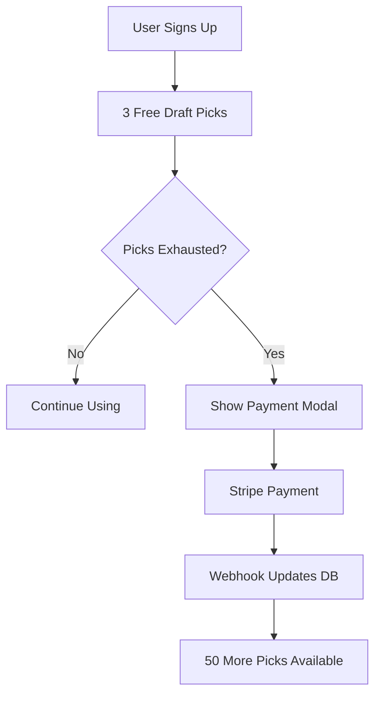

# Stripe Integration Setup Guide

This guide walks you through setting up Stripe payments with your Sacco application.

## 🚀 Quick Setup Steps

### 1. Create Stripe Account
1. Go to [https://stripe.com](https://stripe.com) and create an account
2. Complete your account verification
3. Navigate to the Dashboard

### 2. Get Your API Keys
1. In Stripe Dashboard, go to **Developers > API keys**
2. Copy your **Publishable key** (starts with `pk_test_`)
3. Copy your **Secret key** (starts with `sk_test_`)

### 3. Configure Environment Variables

#### React Frontend (.env file)
Create `/react-frontend/.env` with:
```bash
VITE_SUPABASE_URL=https://sjmljrgabepxdfhefyxo.supabase.co
VITE_SUPABASE_ANON_KEY=your_supabase_anon_key
VITE_STRIPE_PUBLISHABLE_KEY=pk_test_your_publishable_key_here
```

#### Supabase Edge Functions
In Supabase Dashboard > Settings > Edge Functions:
```bash
STRIPE_SECRET_KEY=sk_test_your_secret_key_here
STRIPE_WEBHOOK_SECRET=whsec_your_webhook_secret_here
```

### 4. Set Up Webhook Endpoint
1. In Stripe Dashboard, go to **Developers > Webhooks**
2. Click **+ Add endpoint**
3. Set endpoint URL to: `https://your-project.supabase.co/functions/v1/stripe-webhook`
4. Select these events:
   - `payment_intent.succeeded`
   - `payment_intent.payment_failed`
   - `customer.subscription.created`
   - `customer.subscription.updated`
   - `customer.subscription.deleted`
   - `invoice.payment_succeeded`
5. Copy the **Signing secret** (starts with `whsec_`)

### 5. Enable Stripe Customer Portal
1. In Stripe Dashboard, go to **Settings > Billing > Customer portal**
2. Click **Activate test link**
3. Configure portal settings as needed

### 6. Deploy Supabase Edge Functions
```bash
# From project root
cd supabase
supabase functions deploy create-payment-intent
supabase functions deploy stripe-webhook
supabase functions deploy create-customer-portal
```

### 7. Apply Database Migration
```bash
# Run the migration we created
supabase db push
```

## 🧪 Testing Your Integration

### Test Payment Flow
1. Start your React app: `npm run dev`
2. Sign up for an account
3. Navigate to `/players` 
4. Use draft picks until limit reached
5. Click payment button
6. Use Stripe test card: `4242 4242 4242 4242`

### Test Webhooks
1. Use Stripe CLI for local testing:
```bash
stripe listen --forward-to localhost:54321/functions/v1/stripe-webhook
```

## 💳 Stripe Test Cards

| Card Number | Description |
|------------|-------------|
| `4242 4242 4242 4242` | Successful payment |
| `4000 0000 0000 0002` | Declined payment |
| `4000 0000 0000 9995` | Insufficient funds |

Use any future expiry date, any 3-digit CVC, and any postal code.

## 🔧 Configuration Details

### Product Pricing
- **Free Trial**: 3 draft picks
- **One-time Payment**: $10 for 50 draft picks
- **Future**: Monthly/yearly subscriptions

### Payment Flow


## 🛡️ Security Considerations

1. **Never expose secret keys** in frontend code
2. **Always verify webhook signatures** 
3. **Use HTTPS** for all webhook endpoints
4. **Validate payment amounts** server-side
5. **Monitor for suspicious activity**

## 📚 Additional Resources

- [Stripe Documentation](https://stripe.com/docs)
- [Supabase Edge Functions](https://supabase.com/docs/guides/functions)
- [Stripe React Elements](https://stripe.com/docs/stripe-js/react)

## 🐛 Troubleshooting

### Common Issues

1. **Payment Intent Creation Fails**
   - Check Stripe secret key in Supabase env vars
   - Verify user authentication

2. **Webhooks Not Working**
   - Check endpoint URL and signing secret
   - Verify webhook events are selected

3. **Customer Portal Errors**
   - Ensure customer portal is activated in Stripe
   - Check customer has Stripe customer ID

4. **Frontend Errors**
   - Verify publishable key is set correctly
   - Check browser console for detailed errors

Need help? Check the logs in Supabase Dashboard > Edge Functions > Logs.
